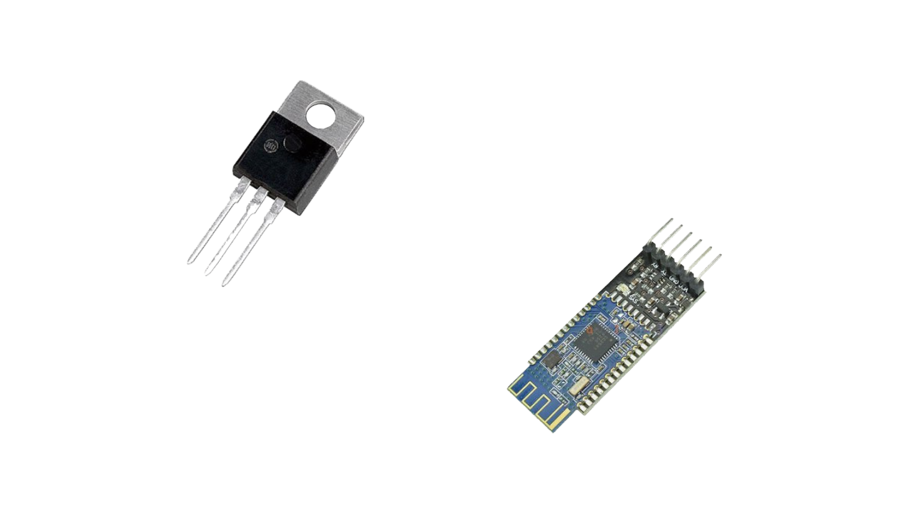

# Simple-Arduino-BLE
A simple to use Bluetooth Low Energy(BLE) Library for Arduino
 
_Currently configured for peripheral mode_

An example of what hardware can be used for this library
* _HM-10_ BLE Module
* **_Optional_** _2n6488g_ NPN Transistor to immediately interrupt the module in case of serial unresponsiveness

